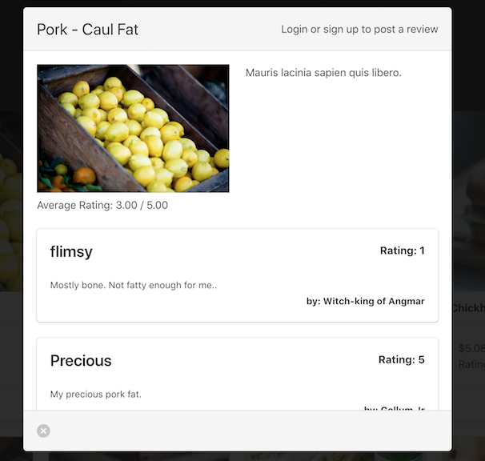
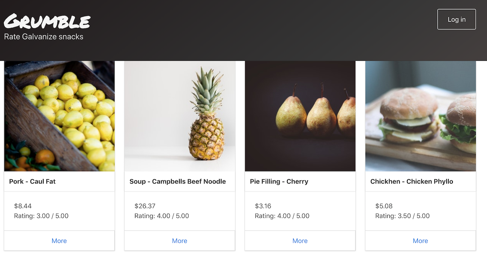

# Grumble-frontend
>Group project to create a snack review app.

## Who is this for?
----
Every day Galvanize students rush to the kitchen to grab their favorite snack. Students only take one to make sure there are plenty to share. It is hard to try a new snack when looking at the selection because you don't want to make a wrong choice. Grumble is a way to rate all the snacks in the kitchen and even leave reviews about them. users can change and delete their reviews, and save all reviews to their own porfile.

live site:

http://grumbleg67.surge.sh/

backend:
https://github.com/atorres6d5/galvanize-snacks

----

